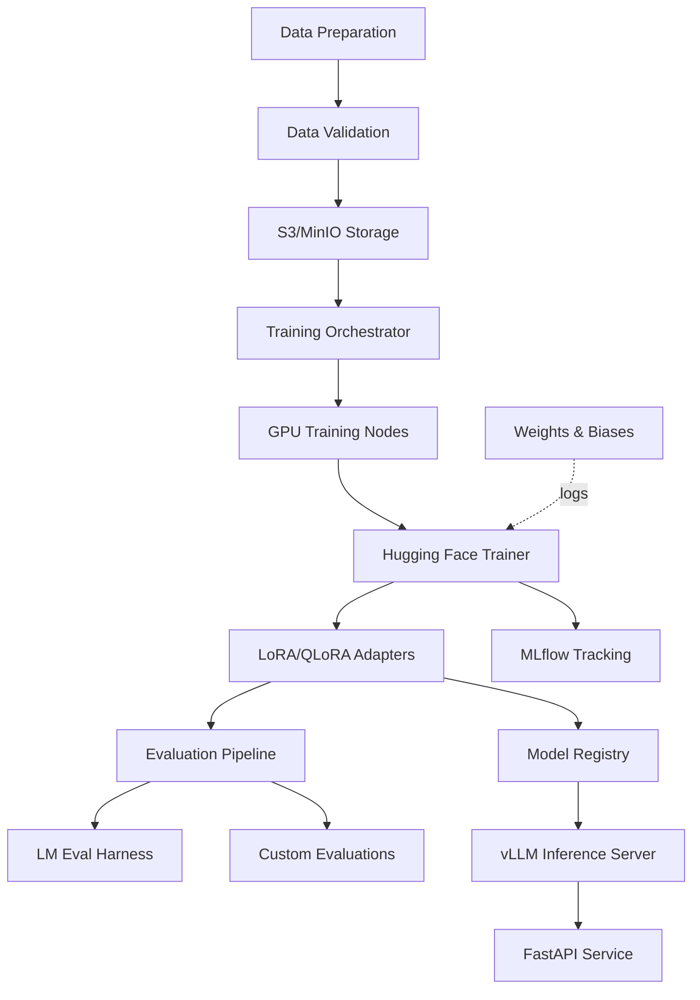

# LLM Fine-tuning Platform

[](https://www.python.org/downloads/)
[](https://pytorch.org/)
[](https://opensource.org/licenses/MIT)

End-to-end platform for fine-tuning open-source LLMs using LoRA/QLoRA with experiment tracking, comprehensive evaluation, and deployment to production inference servers.

## 🎯 Key Features

### Training Infrastructure
- **LoRA/QLoRA**: Parameter-efficient fine-tuning with PEFT library
- **Quantization**: 4-bit and 8-bit training with bitsandbytes
- **Multi-GPU**: DeepSpeed and FSDP for distributed training
- **Flash Attention 2**: Optimized attention for faster training
- **Model Support**: Llama 3/3.1, Mistral, Phi-3, Qwen 2, Gemma 2

### Experiment Tracking
- **MLflow**: Track experiments, parameters, and metrics
- **Weights & Biases**: Real-time training visualization
- **Model Registry**: Version control for models and adapters
- **Comparison Dashboard**: Compare multiple training runs

### Comprehensive Evaluation
- **Standard Benchmarks**: MMLU, HellaSwag, TruthfulQA, ARC
- **Custom Evaluations**: Task-specific evaluation framework
- **Human Eval Interface**: Collect human ratings
- **A/B Testing**: Compare models in production

### Production Deployment
- **vLLM Integration**: Deploy to optimized inference server
- **TGI Support**: Text Generation Inference compatibility
- **Model Merging**: Merge adapters with base models
- **API Endpoints**: RESTful API for inference

## 🏗️ Architecture



## 🚀 Quick Start

### Prerequisites
- Python 3.11+
- CUDA-capable GPU (16GB+ VRAM recommended)
- PyTorch 2.1+

### Installation

```bash
git clone https://github.com/sanketny8/llm-finetuning-platform.git
cd llm-finetuning-platform

# Create virtual environment
python -m venv venv
source venv/bin/activate

# Install dependencies
pip install -r requirements.txt

# Copy config
cp configs/config.example.yaml configs/config.yaml
# Edit config.yaml with your settings
```

### Fine-tune a Model

```bash
# Prepare your dataset
python scripts/prepare_dataset.py --input data/raw/train.json --output data/processed/

# Start training
python train.py \
    --config configs/llama3_lora.yaml \
    --model_name meta-llama/Meta-Llama-3-8B \
    --dataset data/processed/train.json \
    --output_dir models/llama3-finetuned

# Monitor training
# MLflow UI: http://localhost:5000
# W&B: https://wandb.ai/your-project
```

### Evaluate Model

```bash
# Run standard benchmarks
python evaluate.py \
    --model_path models/llama3-finetuned \
    --tasks mmlu,hellaswag,truthfulqa

# Custom evaluation
python scripts/custom_eval.py \
    --model_path models/llama3-finetuned \
    --eval_dataset data/eval/custom_test.json
```

### Deploy to vLLM

```bash
# Merge adapter with base model
python scripts/merge_adapter.py \
    --base_model meta-llama/Meta-Llama-3-8B \
    --adapter_path models/llama3-finetuned \
    --output_dir models/merged

# Start vLLM server
python -m vllm.entrypoints.openai.api_server \
    --model models/merged \
    --tensor-parallel-size 1 \
    --port 8000
```

## 📊 Supported Models

| Model Family | Sizes | LoRA | QLoRA | Flash Attn 2 |
|--------------|-------|------|-------|--------------|
| **Llama 3/3.1** | 8B, 70B | ✅ | ✅ | ✅ |
| **Mistral** | 7B, 8x7B | ✅ | ✅ | ✅ |
| **Phi-3** | 3.8B, 7B, 14B | ✅ | ✅ | ✅ |
| **Qwen 2** | 7B, 72B | ✅ | ✅ | ✅ |
| **Gemma 2** | 2B, 9B, 27B | ✅ | ✅ | ✅ |

## 📈 Benchmark Results

Results on 8B parameter models after fine-tuning on domain-specific data:

| Model | MMLU | HellaSwag | TruthfulQA | ARC-C |
|-------|------|-----------|------------|-------|
| Llama 3 Base | 66.7 | 78.5 | 43.2 | 52.1 |
| **Llama 3 Fine-tuned** | **71.2** | **82.1** | **51.8** | **58.3** |
| Mistral Base | 62.5 | 81.2 | 42.1 | 54.2 |
| **Mistral Fine-tuned** | **67.8** | **84.5** | **49.5** | **60.1** |

## 🔧 Configuration

### Training Configs

```yaml
# configs/llama3_lora.yaml
model:
  name: meta-llama/Meta-Llama-3-8B
  load_in_4bit: true
  
lora:
  r: 16
  lora_alpha: 32
  target_modules: [q_proj, k_proj, v_proj, o_proj]
  lora_dropout: 0.05
  
training:
  batch_size: 4
  gradient_accumulation_steps: 4
  learning_rate: 2e-4
  num_epochs: 3
  warmup_steps: 100
  max_seq_length: 2048
  
optimization:
  optimizer: adamw_torch
  lr_scheduler: cosine
  weight_decay: 0.01
  gradient_checkpointing: true
```

## 📚 Documentation

- [Training Guide](docs/TRAINING.md)
- [Model Support](docs/MODELS.md)
- [Evaluation](docs/EVALUATION.md)
- [Deployment](docs/DEPLOYMENT.md)
- [API Reference](docs/API.md)

## 🧪 Development

### Run Tests

```bash
pytest tests/ -v --cov=src
```

### Training Recipes

Pre-configured training scripts for common tasks:

```bash
# Instruction tuning
python recipes/instruction_tuning.py --model llama3

# Chat fine-tuning
python recipes/chat_finetuning.py --model mistral

# Domain adaptation
python recipes/domain_adaptation.py --model phi3 --domain medical
```

## 💰 Cost Optimization

### Training Costs (8B model, 10K samples)

| Method | GPU | Time | Cost (AWS) |
|--------|-----|------|------------|
| Full Fine-tuning | 4x A100 | 6 hrs | $96 |
| LoRA | 1x A100 | 4 hrs | $16 |
| **QLoRA** | **1x A10G** | **8 hrs** | **$8** |

### Memory Requirements

| Model Size | Full FT | LoRA | QLoRA |
|------------|---------|------|-------|
| 7B | 28GB | 14GB | **6GB** |
| 13B | 52GB | 24GB | **10GB** |
| 70B | 280GB | 140GB | **35GB** |

## 🔐 Security

- Model weight encryption
- Secure API key management
- Dataset privacy controls
- Audit logging for all training runs

## 📄 License

MIT License - see [LICENSE](LICENSE) file

## 🙏 Acknowledgments

- Hugging Face for Transformers and PEFT
- Tim Dettmers for bitsandbytes and QLoRA
- EleutherAI for LM Evaluation Harness
- vLLM team for optimized inference

## 📞 Contact

**Author**: Sanket Nyayadhish  
**Twitter**: [@Ny8Sanket](https://twitter.com/Ny8Sanket)  
**LinkedIn**: [ny8sanket](https://linkedin.com/in/ny8sanket)

---

⭐ Star this repo if you find it helpful!

